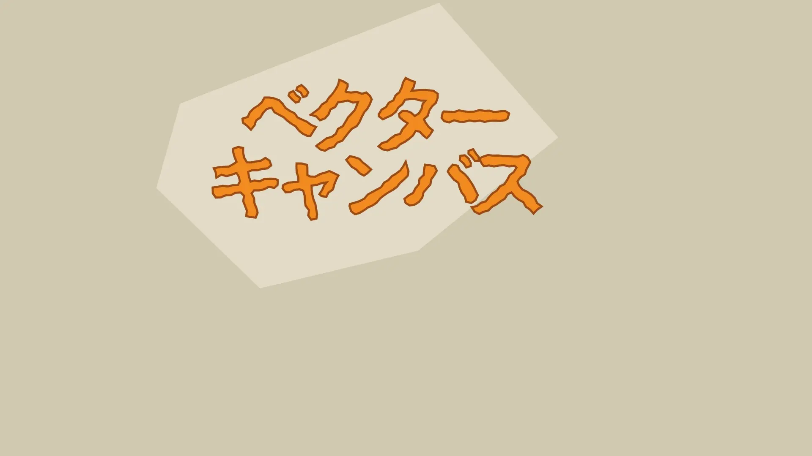
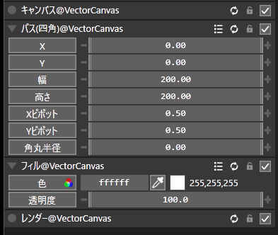
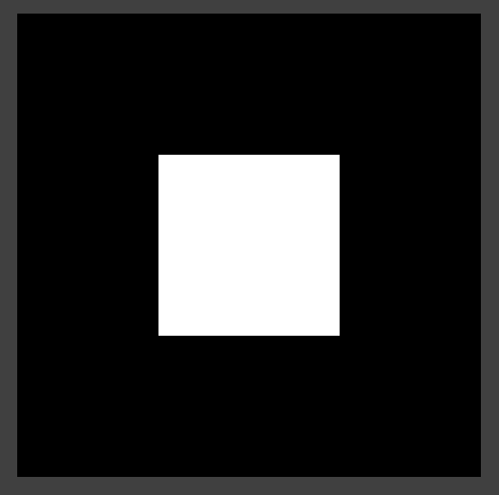

# ベクターキャンバス

複雑なベクターグラフィックスを AviUtl ExEdit2 で扱うためのスクリプト群です。

図形やSVGパスを描画するのはもちろん、線の揺れやブーリアンのようなベクター系効果が適用できます。

## インストール方法

AviUtl2のスクリプトフォルダ `C:\ProgramData\aviutl2\Script\` に `VectorCanvas` フォルダを作成して、以下のファイルを配置してください。

- `@VectorCanvas.anm2`
- `vectorcanvas.mod2`

## 使い方

ベクターキャンバスは、小さなスクリプトを組み合わせて使う設計になっています。ひとつのスクリプト単体では動作しません。

基本構成：

1. `キャンバス @VectorCanvas`
2. `パス(...) @VectorCanvas` 系スクリプト
3. `ストローク @VectorCanvas` または `フィル @VectorCanvas`
4. `レンダー @VectorCanvas`

イメージ：

1. 仮想キャンバスを作成
2. 図形データを追加
3. 図形データを編集
4. 図形データの線や塗りを定義
5. 実際の画像として書き出す

例：

まず適当なオブジェクトに「**キャンバス**」と「**レンダー**」を追加してください。

それらのあいだに、図形データを作成する「**パス(...)**」や、描画を定義する「**ストローク**」「**フィル**」などのスクリプトを追加していきます。

出力結果：

以上はシンプルな例ですが、各スクリプトを組み合わせることで、より複雑なベクター描画が可能です。

## 各スクリプトの機能

### キャンバス

ベクター描画用のキャンバスを作成します。必ず一番上に配置してください。

### レンダー

それまでに追加されたスクリプトの情報から画像をレンダリングします。必ずベクターキャンバス系スクリプトの最後に配置してください。

### パス

図形や線のデータを追加します。

- `パス(直線)`：シンプルな直線
- `パス(2点)`：シンプルな直線（座標をトラックバーでアニメーションできます）
- `パス(折線)`：直線を複数つなげた図形
- `パス(テキスト)`：テキスト
- `パス(四角)`：正方形・長方形・角丸四角形
- `パス(多角形)`：正多角形・星型
- `パス(円)`：円・楕円・円弧
- `パス(グリッド)`：縦横に並んだ線
- `パス(コマンド)`：[SVGのパスコマンド](https://developer.mozilla.org/ja/docs/Web/SVG/Tutorials/SVG_from_scratch/Paths)を直接入力して任意のパス形状を作成

### ストローク

それまでに追加したパスの輪郭線を描きます。

- 色
- 透明度
- 太さ
- 破線
- 線の形状：端の丸め等
- トリム：線を一部分だけを描画

### フィル

それまでに追加したパスを塗りつぶします。

- 色
- 透明度

### キャンバス効果

それ以降の描画全体に対して処理を行います。

- `キャンバス効果(トランスフォーム)`：移動・拡大・回転を適用

### パス効果

それまでに追加したパスに対して処理を行います。

- `パス効果(トランスフォーム)`：移動・拡大・回転を適用
- `パス効果(ストロークをパスに)`：ストロークをパスへ変換（このスクリプトよりも上に `ストローク` を追加したうえで、このスクリプトの下に `ストローク` や `フィル` を追加してください）
- `パス効果(丸め)`：パスを丸める
- `パス効果(簡略化)`：パスの交差部分を簡略化
- `パス効果(ブーリアン)`：複数のパスを融合（図形の和・積）
- `パス効果(ノイズ)`：パスを手書き風に

### パス複製

それまでに追加したパスを複製して並べます。

- `パス複製(配列)`：パスを一定方向・一定角度で複製
- `パス複製(グリッド)`：パスをグリッド状に複製
- `パス複製(ランダム)`：パスをランダムな位置へ複製

## ライセンス

MIT License

## メモ

多用するとやや重たいかもしれません。これは内部で使用しているレンダリングエンジン Skia を毎フレーム呼び出して `obj.putpixeldata()` で描画するためです。大きなキャンバスを複数作るのは避けつつ、ここぞというところで使うのがおすすめです。
